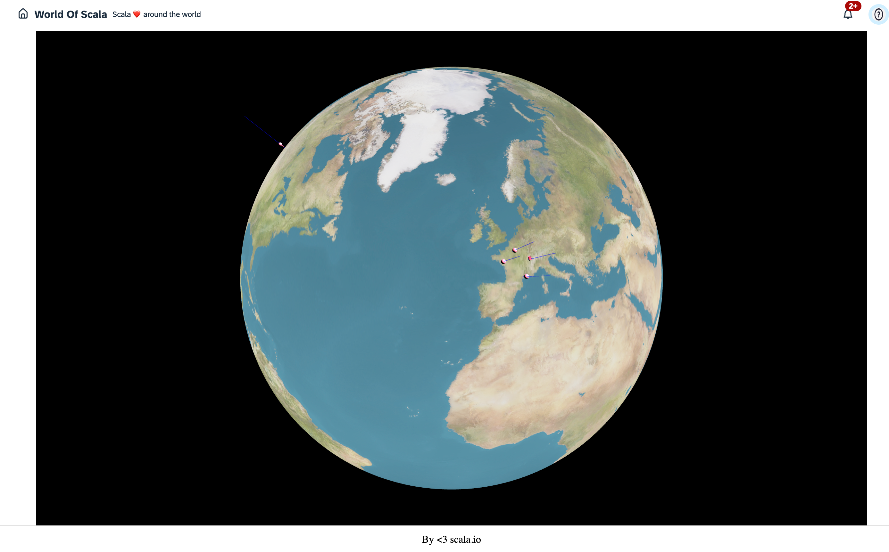

# Welcome World Of Scala project!

This project intention is the study of the Scala programming language and its ecosystem.

This is a full stack Scala project, using Scala.js for the client and ZIO for the server.



## Libraries && Tooling

### Libraries
* Backend:
  * ZIO [https://zio.dev/](https://zio.dev/)
  * Tapir [https://tapir.softwaremill.com/en/latest/](https://tapir.softwaremill.com/en/latest/)
  * ZIO-Quill [ZIO-Quill](https://zio.dev/zio-quill/)
  * Flyway [https://flywaydb.org/](https://flywaydb.org/)
* Frontend:
  * Laminar [https://laminar.dev/](https://laminar.dev/)
  * Three.js [https://threejs.org/](https://threejs.org/)
  * Chart.js [https://www.chartjs.org/](https://www.chartjs.org/)


### Tooling

* Backend
 * sbt [https://www.scala-sbt.org/](https://www.scala-sbt.org/)
 * docker [https://www.docker.com/](https://www.docker.com/)

* Frontend
 * npm [https://www.npmjs.com/](https://www.npmjs.com/)
 * vite [https://vitejs.dev/](https://vitejs.dev/)
 * ScalablyTyped [https://scalablytyped.org/](https://scalablytyped.org/)


## Pre-requisites

- JDK
- sbt
- Node.js
- Docker running

Decent vesions of JDK, sbt and Node.js are required.

## Getting started

To get started, run the following command:

```bash
./scripts/fullstackRun.sh
```

http://localhost:8080/public/index.html


## Development

Development is done in two parts: the server and the client.

* The server is a ZIO application that serves the client.

* The client is a Scala.js application that is served by the server.

  * The client is built using the `fastLinkJS` command.
  * Vite is used to serve the client in development mode, with hot reloading.

### VS Code

VS Code is the recommended IDE for this project. The project is configured to work with Visual Studio Code.

* The Scala (Metals) extension is recommended.

Just open the project in VS Code:

```bash
code .
```

Details here [VS Code](./docs/vscode.md).

### Manually

Details on how to setup the development environment manually can be found in the [manual](./docs/manual.md).


## Production

To build the project for production, run the following command:

* With ESModule
```bash
./scripts/fullstackBuild.sh
```

* With CommonJS
```bash
./scripts/fullstackBuild.sh -n
```

Details here [Production](./docs/production.md).