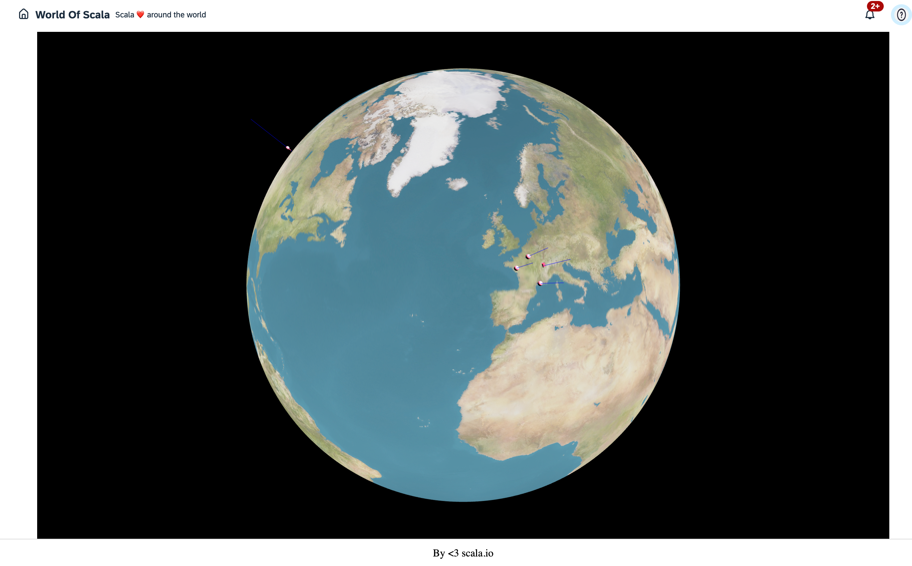

# Welcome World Of Scala project



## Overview

"World of Scala" is a full-stack web application built entirely in Scala. It showcases a modern, type-safe technology stack and is designed to be a social platform for Scala developers. The application allows users to create accounts, form organizations, and contribute 3D models (meshes) that are displayed on a 3D globe.

The project is structured as a multi-project sbt build, with clear separation between the server-side, client-side, and shared code. This modular design promotes code reuse and maintainability.

## Credits

This project was inspired by the Rock the JVM course [ZIO Rite of Passage](https://courses.rockthejvm.com/p/zio-rite-of-passage).


## Technology Stack

The project leverages a range of modern libraries and frameworks from the Scala ecosystem:

*   **Backend:**
     *   **ZIO:** For asynchronous and concurrent programming.
     *   **Tapir:** For defining type-safe, boilerplate-free HTTP endpoints.
     *   **ZIO Magnum:** For type-safe database queries (replaces ZIO Quill).
     *   **OpenTelemetry:** For distributed tracing, structured logging, and metrics collection.
     *   **Flyway:** For managing database migrations.
     *   **PostgreSQL:** As the primary database.
*   **Frontend:**
    *   **Scala.js:** For writing frontend code in Scala.
    *   **Laminar:** For building reactive user interfaces.
    *   **Three.js:** For rendering the 3D globe and meshes.
    *   **frontroute:** For client-side routing.
*   **Build & Deployment:**
    *   **sbt:** As the build tool.
    *   **Docker:** For containerizing the application.
    *   **docker-compose:** For orchestrating the application and database services.
    *   **bun & vite:** For managing frontend dependencies and serving the client in development mode.
    *   **ArgoCD**: For continuous deployment in Kubernetes environments.


## Architecture

The project follows a hexagonal (ports and adapters) architecture on top of a multi-project sbt build. Code is separated into domain, application, infrastructure, and interface layers across four module groups:

*   **`domain`** (cross-project, JS & JVM): Pure domain models shared across all modules (`User`, `Mesh`, `NewOrganisation`). This is the innermost layer of the hexagonal architecture.

*   **`backend`** (aggregate project containing three sub-modules):
    *   **`backend/domain`**: Defines ports (traits) that specify persistence contracts, e.g. `UserPersistencePort`, `OrganisationPersistencePort`, `MeshMagnumPersistencePort`.
    *   **`backend/persistence/magnum`**: Infrastructure layer implementing the persistence ports using ZIO-Magnum against PostgreSQL.
    *   **`backend/server`**: Application and interface layer — services (business logic), controllers (HTTP endpoint handlers), OpenTelemetry integration, JWT authentication, and Flyway database migrations.

*   **`shared`** (cross-project, JS & JVM): Code shared between the server and the client. Includes Tapir endpoint definitions, view models, authentication tokens, and a unified error handling mechanism that maps application-specific exceptions to HTTP error codes.

*   **`client`** (Scala.js): The frontend application with Laminar (reactive UI), Three.js (3D globe rendering), and frontroute (client-side routing).

### sbt subproject IDs

| sbt ID | Description |
|---|---|
| `root` | Aggregate root |
| `backend` | Aggregate: `domainBackend`, `server`, `persistenceMagnum` |
| `domainBackend` | Backend domain ports (traits) |
| `persistenceMagnum` | ZIO-Magnum persistence adapters |
| `server` | HTTP server, controllers, services |
| `domain`, `domainJs`, `domainJvm` | Shared domain models (cross-project) |
| `shared`, `sharedJs`, `sharedJvm` | Shared endpoints, views, auth (cross-project) |
| `client` | Scala.js frontend (Laminar, Three.js, frontroute) |

## Database

The application uses a PostgreSQL database, with the schema managed by Flyway. The database schema has evolved over time to include:

*   **`users`:** Stores user information, including credentials.
*   **`organisations`:** Stores information about organizations, including their name, location, and the user who created them.
*   **`meshes`:** Stores 3D model data, including a label and an optional thumbnail.

The use of Flyway ensures that the database schema is always in a consistent state and can be easily evolved as the application grows.

## Deployment

The application is designed to be run in a containerized environment using Docker.

### Locally

 The `docker-compose.yml` and `docker-compose-all.yml` files provide a convenient way to run the application and its database with a single command.

The `docker-compose-all.yml` file defines two services:

*   **`db`:** A PostgreSQL database service.
*   **`web`:** The application server, which is built from a Docker image.

This setup makes it easy to run the application in a development or production environment with minimal configuration.

### ArgoCD

The project can also be deployed in a Kubernetes environment using ArgoCD for continuous deployment. The `k8s` directory contains the necessary Kubernetes manifests and ArgoCD application definitions to deploy the application and manage its lifecycle.


## Pre-requisites

*   JDK 23 (Zulu)
*   sbt 1.13.0
*   Scala 3.9.0
*   bun (Node.js package manager used for client dev server and npm operations)
*   Docker running

Decent versions of JDK, sbt, and Node.js are required.

## Getting started

To get started, run the following command:

```bash
./scripts/fullstackRun.sh
```

<http://localhost:8080/public/index.html>

### Build & Test Commands

| Command | Description |
|---|---|
| `sbt compile` | Compile all main sources |
| `sbt test` | Run all tests across all modules |
| `sbt "server/test"` | Run backend server tests |
| `sbt "shared/test"` | Run shared (JVM) tests |
| `sbt "testOnly org.worldofscala.service.HasherSuite"` | Run a single test suite |
| `sbt scalafmtCheckAll` | Check code formatting |
| `sbt scalafix` | Run Scalafix (OrganizeImports, RemoveUnused) |
| `./scripts/ci-build.sh` | CI build: compiles server + bundles client |
| `./scripts/fullstackBuild.sh` | Production build (ESModule) |

## Development

Development is done in two parts: the server and the client.

* The server is a ZIO HTTP application (in the `server` module under `backend/`) that serves the client.

* The client is a Scala.js application that is served by the server.

  * The client is built using the `fastLinkJS` command.
  * Vite is used to serve the client in development mode, with hot reloading.

### Observability

OpenTelemetry is used to collect metrics, traces and logs.


Details here [Observability](./docs/observability.md).


### VS Code

VS Code is the recommended IDE for this project. The project is configured to work with Visual Studio Code.

* The Scala (Metals) extension is recommended.

Just open the project in VS Code:

```bash
code .
```

Details here [VS Code](./docs/vscode.md).

### Manually

Details on how to setup the development environment manually can be found in the [manual](./docs/manual.md).

## Production

To build the project for production, run the following command:

* With ESModule

```bash
./scripts/fullstackBuild.sh
```

* With CommonJS

```bash
./scripts/fullstackBuild.sh -n
```

Details here [Production](./docs/production.md).

